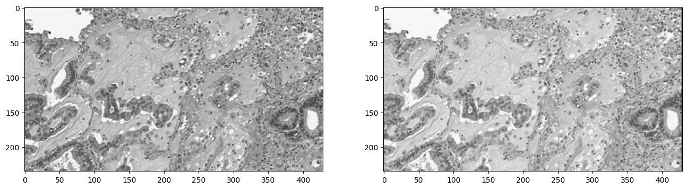

# pypatchmatch


<p align="center">
<em>"Once upon a time<br>
You randomly croped some tiles<br>
From some whole slides<br>
Where does the tile lie in slide<br>
Pixel-wise comparison will let you die<br>
Thank God that here is a light<br>
`pypatchmatch` will save your life"</em>
</p>


`pypatchmatch` is a python implementation that can help you efficiently find the location of all patches in one of several WSIs (whole slide images).

# Table of Contents

- [pypatchmatch](#pypatchmatch)
- [Table of Contents](#table-of-contents)
- [Installation](#installation)
- [Usage](#usage)
  - [Output](#output)
- [API reference](#api-reference)
  - [`match` function](#match-function)
  - [`save_json` function](#save_json-function)
- [Example](#example)

# Installation

1. Clone or download
    - Use the command bellow in terminal to clone this repo:
    ```
    git clone https://github.com/samson6460/pypatchmatch.git
    ```

    - Or just download whole files using the **[Code > Download ZIP]** button in the upper right corner.
    
2. Install dependent packages: 
    ```
    cd pypatchmatch
    pip install -r requirements.txt
    ```

    > If you have problems installing openslide, please refer to the link: https://openslide.org/api/python/.

# Usage

Even you have no idea about which patches belong to which WSI, just put all the patches in one folder and all the possible WSIs in another folder.

Then run the following command in your terminal ... done!

```
python match.py dir_wsi dir_patch [-lv LEVEL] [-ow ORIGINAL_WIDTH] [-oh ORIGINAL_HEIGHT] [-ds DSAMPLE] [-t THRESHOLD] [-fr FINETUNE_RANGE] [-ft FINETUNE_THRESH] [-v] [-o OUTPUT]
```

- **positional arguments**:
  - **dir_wsi**: directory of whole slide images
  - **dir_patch**: directory of patch images

- **optional arguments**:
  - **-h, --help**: show this help message and exit.
  - **-lv, --level**: level number for cropping patches from WSI, defualt: 0.
  - **-ow, --original_width**: original width of cropped patches, defualt: 3432.
  - **-oh, --original_height**: original height of cropped patches, defualt: 1884.
  - **-ds, --dsample**: downsampling rate for matching, default: 8.
  - **-t, --threshold**: threshold for SIFT algorithm, range: 0~1, default: 0.4.
  - **-fr, --finetune_range**: the pixel range for validating matched patch, default: 60.
  - **-ft, --finetune_thresh**: threshold for fine-tuning, range: 0~1, default: 0.9.
  - **-v, --verbose**: display cropping and patch image.
  - **-o, --output**: path of output file, default: "output.json".

## Output

The output file will be saved as a json file and the format will look like this:

```
{
    "XXXX1.jpg": {
        "WSI name": "aabbcc.svs",
        "start coord": [23311, 8140]
    },
    "XXXX2.jpg": {
        "WSI name": "aabbcc.svs",
        "start coord": [20989, 11200]
    },
    "XXXX3.jpg": {
        "WSI name": "ccbbaa.tiff",
        "start coord": [24820, 9847]
    },
    .
    .
    .
}
```

`"start coord"` refers to the location (top left anchor) of patch in WSI of level 0.

# API reference

You can also use the following API functions in an interactive environment like **jupyter notebook**.

## `match` function

```
match.match(dir_wsi: str, dir_patch: str,
    level=0, ori_crop_size=(3432, 1884),
    dsample_match=8, threshold=0.4,
    finetune_range=60, finetune_thresh=0.9,
    debug_mode=False)
```

- **dir_wsi**: string, directory of whole slide images.
- **dir_patch**: string, directory of patch images.
- **level**: integer, level number for cropping patches from WSI.
- **ori_crop_size**: tuple of two integers, original size of cropped patches.
- **dsample_match**: integer, downsampling rate for matching.
- **threshold**: float (0~1), threshold for SIFT algorithm.
- **finetune_range**: integer, the pixel range for validating matched patch.
- **finetune_thresh**: float (0~1), threshold for fine-tuning.
- **debug_mode**: boolean, whether to show cropping and patch image.

***Returns***

A dictionary contains matching information with the same format as output json.

## `save_json` function

```
match.save_json(matched_dict: dict, path: str):
```

- **matched_dict**: dictionary, the return from match().
- **path**: string, path of output file.

# Example

1. Click the button below to download a little data from **TCGA** for testing:

[](https://drive.google.com/drive/folders/1OkUhOYrKlt9pP5S05a1px4bgGJBD4-uU?usp=sharing)

> "The patches and WSI here are based upon data generated by the TCGA Research Network: https://www.cancer.gov/tcga."

2. Run the following command in terminal (replace \<root> to yours):

```
python match.py <root>/PatchMatch/tcga_wsi  <root>/PatchMatch/tcga_wsi -v
```

You are supposed to see some output like this:

```
Matching patches in slide: TCGA-55-6983-01Z-00-DX1.8f940a64-1f1b-4e6e-99ea-418175be2b3f.svs
```


```
100%|██████████████████████████████████████████████████████████████████████████████████████████████████████████████████████████████████| 351/351 [03:02<00:00,  1.93it/s]
Checking and fine-tuning patch: S005.jpg ...
100%|██████████████████████████████████████████████████████████████████████████████████████████████████████████████████████████████| 3600/3600 [00:03<00:00, 1150.13it/s]
min cross entropy: 348.647378096351
dist: 0.0
Matched!
Patch: S005.jpg is in slide: TCGA-55-6983-01Z-00-DX1.8f940a64-1f1b-4e6e-99ea-418175be2b3f.svs, start with: (23311, 8140).
```



```
Checking and fine-tuning patch: S004.jpg ...
100%|███████████████████████████████████████████████████████████████████████████████████████████████████████████████████████████████| 3600/3600 [00:04<00:00, 781.99it/s]
min cross entropy: 325.29451424359223
dist: 0.0
Matched!
Patch: S004.jpg is in slide: TCGA-55-6983-01Z-00-DX1.8f940a64-1f1b-4e6e-99ea-418175be2b3f.svs, start with: (20989, 11200).
.
.
.
Matched 10/10 patches.
Saved output file to "output.json" successfully.
```
